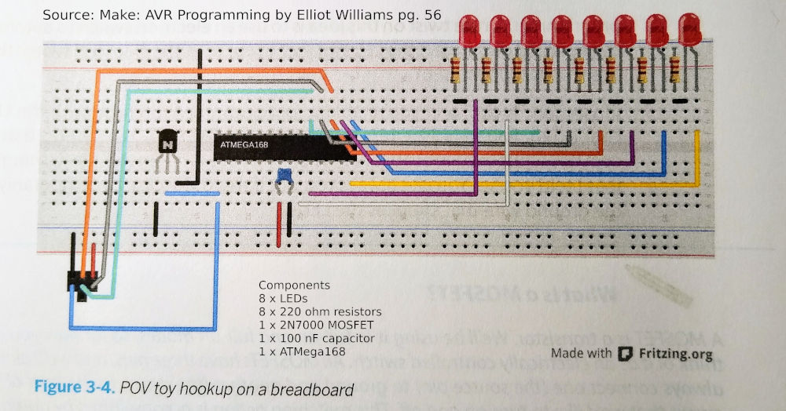

AVR Assembly: Project Intent
============================

This project consists of notes and examples that I worked on
while learning AVR assembly language programming for the first
time.

Most or all of the examples assume use of the `atmega168p`. I
haven't used any headers for constants (which forces me to 
really understand where these values come from) so these programs
will require adaptation to use with other AVR chips. The mods
required should be minor, though.

I've used a breadboard set up as per the example on page 56 of 
[Make: AVR Programming by Elliot Williams](https://www.amazon.com/AVR-Programming-Learning-Software-Technology/dp/1449355781/).



Notes on AVR Assembly Setup
===========================


Setting Up Avra Assembler
-------------------------

Download the source code for avra from Github: 
	
	git@github.com:Ro5bert/avra.git

To build avra from scratch:

```sh
# cd into the root directory and run:
make
```

Check Programmer Connection
===========================

To check the device/programmer are working, run the command
below (adjust for your programmer and chip):

```
avrdude -c usbasp -p m168

-c	programmer type
-p	AVR part/device
```

If you call `avrdude -c` without the part, it will give you 
a list of available AVR device strings to choose from.

Note, my chips that look like `m168p` read as `m168`. Shrug?

Check Fuse Settings
===================

You can check the fuse settings like:

	avrdude -c usbasp -v -p m168

I noticed that it won't output information about the fuses if 
it thinks that the chip is wrong, however.

Building
========

To build using avra is trivial:

	avra filename.asm

Flashing the Chip
=================

	avrdude -c usbasp -p m168 -U flash:w:hello.hex
	
You may also want to set the bitrate:

	-b 57600

Obviously, change these settings however it makes sense for your
particular setup.

A Note on Power
===============

I noticed that the AVR chips can be a bit sensitive about VCC
while being programmed, and that power via USB / programmer
isn't always reliable. If something isn't working, try using 
a real power supply.

I/O Registers
=============

AVR I/O registers are 64 bytes in data memory just after the 32
general working registers `(0x20 - 0x5F)`. They include the PORT,
PIN, and DDR registers that control the m/c's pins.

Note that the Status Register (`SREG`) is one of the I/O registers.

AVR assembly language has instructions just for dealing with 
the I/O registers:

`in`		In from I/O location
`out`		Out from I/O location
`cbi`		Clear a bit in an I/O register (first 32 registers)
`sbi`		Set a bit in an I/O register (first 32 registers)
`sbic`		Skip if bit in I/O register is 0
`sbis`		Skip if bit in I/O register is 1

`cbi` and `sbi` only work with the first 32 I/O registers. All
PORT, PIN and DDR registers are in the first 32 memory locations.
`c/sbi` are useful for setting output to pins.

`cbi` and `sbi` use a pin number and not a mask, so you can only
set one pin at a time. `in/out` may be more efficient.

`sbis/sbic` can skip the next instruction based on a bit in an 
I/O register, so you can use this to check the state of a pin.

Examples:

```asm
in	r15, DDRB	; load DDRB to r15
out	DDRB, r0	; load r0 to DDRB
```

I/O Addresses
=============

There are Data Memory addresses, and there are I/O addresses.
I/O addresses are mapped to data memory addresses, in order to
be able to more efficiently access (some) I/O addresses.

Data memory address `0x20` maps to I/O `0x00`.

You can see how this is useful: by renumbering the I/O addresses,
it allows access to the first 32 in 5 bits.

Extended I/O Addresses
======================

Extended I/O and SRAM allow for direct access using the `lds` and
`sts` instructions. Because these addresses are out of the range
of the first 32 I/O registers, we can't use `in` or `out` with 
them. `sts/lds` work with the general purpose registers and up
to 64K of memory. Prefer to use these with r16-r31, it's more
efficient.

### References
- http://www.rjhcoding.com/avr-asm-io.php

AVR Instruction Notes
=====================

(Random and incomplete)

	ldi rd, imm

Loads an 8-bit number (0-255) into an upper half register (16-31)

	out rd, r

Copies a number from a working register to an I/O register.

	rjmp label

Jumps to the label. The label cannot be more than 204 instructions away. This is a "relative" jump.

